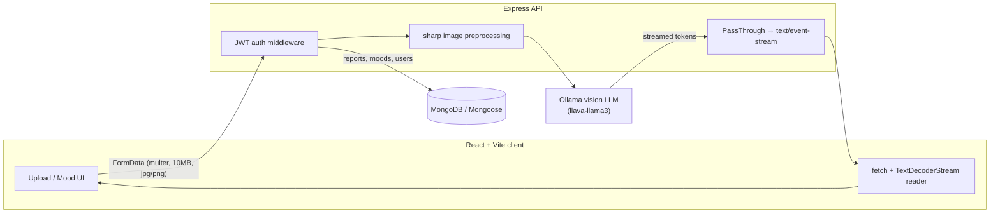
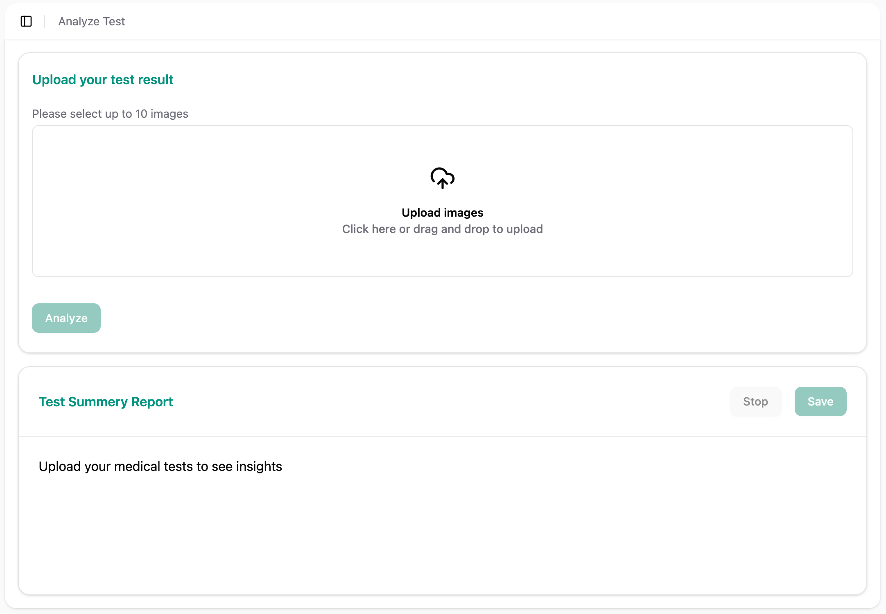
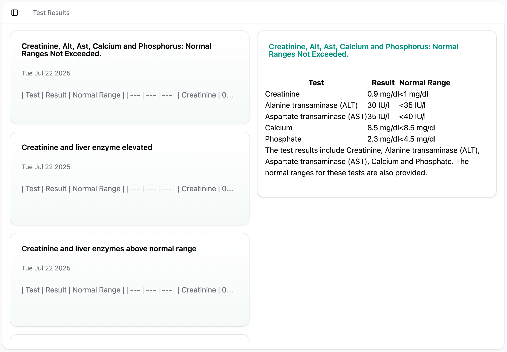
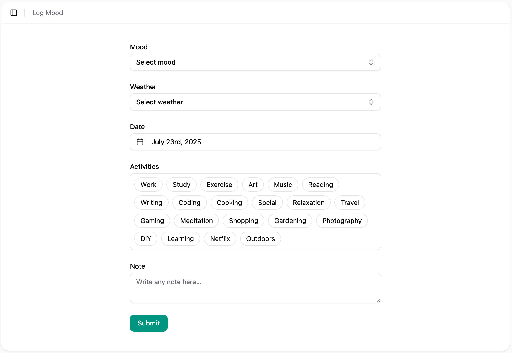
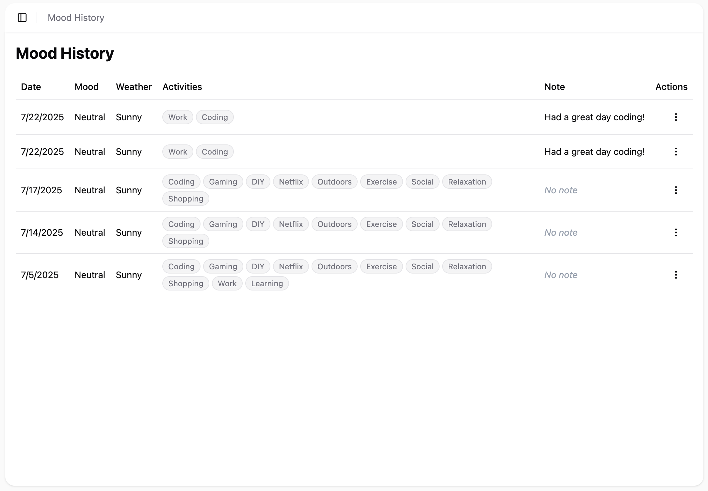
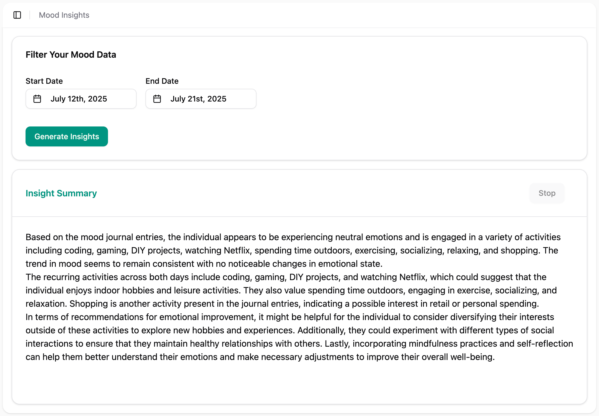

# Doc Dolphin

**Live Demo**: [doc-dolphin.netlify.app](https://doc-dolphin.netlify.app)

**Project board**: [Trello](https://trello.com/invite/b/68765b283bea634cb81d201a/ATTI4212a377d617cc4c24f9b3109b31484f0A39F776/capstone)

**Doc Dolphin** is an AI-powered health companion that analyzes lab-report images, tracks daily mood, and generates insights about your emotional well-being. A multimodal vision model reads the report image directly, and its analysis is streamed back to the browser token-by-token.

> **Medical disclaimer**: Doc Dolphin is not a substitute for professional medical advice, diagnosis, or treatment. Always seek the advice of your physician or a qualified mental health provider.

## Features

### Test Analyzer
- Upload up to 10 lab-report images (JPG/PNG); they are merged and preprocessed before analysis
- AI-generated, streaming explanation of the results, rendered as live Markdown
- Save analyzed reports (with an auto-generated title) to your history

### Results Dashboard
- Centralized, paginated view of all saved reports
- Open any past report to revisit its analysis

### Mood Journal
- Daily mood logging with weather, activities, and free-text notes

### Mood History
- Sortable table of past entries with inline edit and delete

### Mood Insights
- AI analysis of mood entries over a chosen date range, streamed live
- Personalized observations and tips based on your journal

## Architecture



**How it works**

- **Real token streaming, end to end.** The server runs Ollama with `stream: true`, pipes each chunk through a Node `PassThrough` as `text/event-stream`, and the client consumes it incrementally with `response.body.pipeThrough(new TextDecoderStream()).getReader()` plus an `AbortController` stop button. No polling, no fake typing.
- **Vision-LLM document understanding (no separate OCR step).** Uploaded images are rotated, resized to a fixed width, grayscaled, and vertically composited into a single optimized JPEG with `sharp`, then passed base64 to a multimodal model (`llava-llama3` via Ollama). This cuts token cost and latency while letting the model read the report directly.
- **JWT auth with bcrypt.** Passwords are hashed with bcrypt and validated with `validator` (strong-password + email checks). Login issues a short-lived (3d) JWT; an Express middleware verifies the `Bearer` token on every protected route.
- **Server-side pagination.** Saved reports are paged with a single Mongoose `$facet` aggregation that returns the page data, total count, and total pages in one round-trip.

## Tech Stack

**Frontend**
- React (Hooks + Context) with Vite
- shadcn/ui + Tailwind CSS + Lucide icons
- React Router
- Fetch API with the Streams API for live token streaming

**Backend**
- Node.js + Express 5
- MongoDB + Mongoose 8
- bcrypt for password hashing, `validator` for input checks
- JWT for authentication
- multer for image uploads, `sharp` for preprocessing

**AI**
- Ollama running a `llava-llama3` multimodal model
- Vision-based lab-report reading (model reads the image directly)
- Streaming analysis for both lab reports and mood insights

## Screenshots

> Light and dark captures of the main screens. (Images live in `client/public/`.)

| Analyzer | Results |
|---|---|
|  |  |

| Log Mood | Mood History | Mood Insights |
|---|---|---|
|  |  |  |

## Prerequisites

- **Node.js** 18+
- **MongoDB** (local or a connection string)
- **Ollama** running locally, with the vision model pulled:
  ```bash
  ollama pull llava-llama3:8b-v1.1-fp16
  ```

## Installation

### 1. Clone the repository
```bash
git clone https://github.com/Rajskij/doc-dolphin.git
cd doc-dolphin
```

### 2. Server (Express API)
```bash
cd server
npm install
cp .env.example .env   # then fill in the values below
npm start
```

### 3. Client (React + Vite)
```bash
cd client
npm install
cp .env.example .env   # set VITE_API_URL to your running server
npm run dev
```

## Configuration

### Backend — `server/.env`

| Variable | Required | Description |
|---|---|---|
| `MONGO_URI` | yes | MongoDB connection string |
| `JWT_SECRET` | yes | Secret used to sign/verify JWTs |
| `PORT` | yes | Port the API listens on (e.g. `8000`) |
| `OLLAMA_URL` | yes | Base URL of your Ollama server (e.g. `http://localhost:11434`) |

### Frontend — `client/.env`

| Variable | Required | Description |
|---|---|---|
| `VITE_API_URL` | yes | Base URL of the Express API (e.g. `http://localhost:8000`) |

## License

MIT

